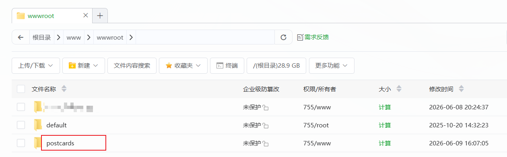
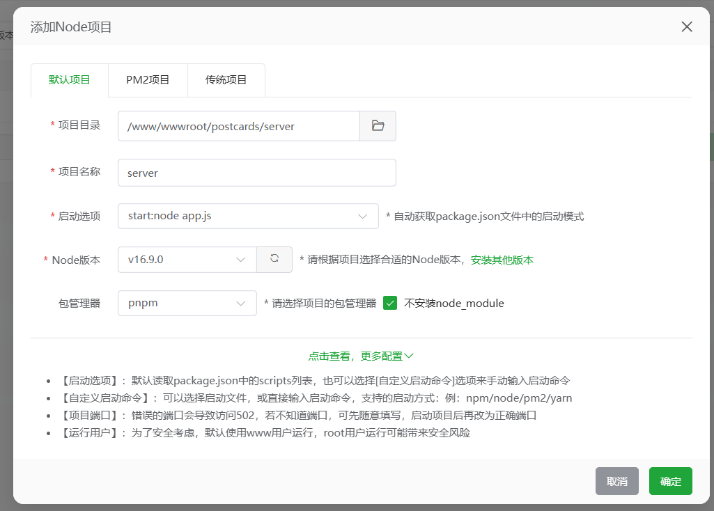

# 部署文档

本文档详细介绍如何将明信片管理系统部署到云服务器。

## 📋 部署前准备

### 服务器要求

- **操作系统**：Linux（推荐 CentOS 7+ / Ubuntu 20.04+）
- **内存**：至少 1GB
- **硬盘**：至少 10GB
- **Node.js**：16.x 或更高版本
- **MySQL**：5.7 或更高版本
- **Nginx**：用于反向代理（可选）

### 需要准备的信息

- [ ] 服务器 IP 地址
- [ ] 服务器 SSH 登录凭证
- [ ] 数据库连接信息
- [ ] 域名（可选）

---

## 🚀 部署方式一：宝塔面板（推荐）

### 1. 安装宝塔面板

阿里云可以直接部署时选择宝塔面板，更方便

### 2. 安装软件

初始化时就会选择安装软件，按照推荐安装即可，后期加一个Node.js

### 3. 创建数据库

1. 宝塔面板 → **数据库** → **添加数据库**
2. 填写信息：
   - 数据库名：`postcard`
   - 用户名：`postcard`
   - 密码：`设置一个强密码`
   - 访问权限：`本地服务器` 或 `所有人`
3. 点击 **提交**

### 4. 配置环境变量
将.env.example重命名为.env，配置以下内容
```bash
# 数据库配置
DB_HOST=localhost
DB_PORT=3306
DB_USER=postcard
DB_PASSWORD=你的数据库密码
DB_NAME=postcard

# 服务端口
PORT=3000

# JWT 密钥（请修改为随机字符串）
JWT_SECRET=你的JWT密钥
JWT_EXPIRES_IN=24h

# 允许访问的域名（可选，不设置则允许所有）
# ALLOWED_ORIGINS=http://你的域名,https://你的域名
```

然后将此项目中这些文件上传至阿里云服务器，
```
根目录/
├── server/
│   ├── migrations/
│   │   └── 001_create_users_table.sql
│   ├── .env
│   ├── app.js
│   ├── package-lock.json
│   └── package.json
├── admin.html
├── app.js
├── cityData.js
├── dashboard.html
├── detail.html
├── index.html
└── timeline.html
```
一般上传至
### 5. 创建 Node 项目

1. 宝塔面板 → **网站** → **Node项目** → **添加项目**
2. 填写信息：
   - 项目目录：选择你上传代码的目录
   - 项目名称：`postcards`
   - 启动文件：`server/app.js`
   - Node版本：选择已安装的版本
   - 包管理器：`npm`
3. 点击 **提交** 如下


### 6. 初始化数据库

在本地执行

```bash
npm run migrate
```

### 7. 创建管理员
在本地运行
```bash
npm run create-admin
```

按提示输入用户名和密码。

如此就可以通过http://domain/admin.html 访问后台管理系统

---

## 📝 常见问题

### Q: 启动失败，提示端口被占用

```bash
# 查找占用端口的进程
lsof -i :3000

# 杀掉进程
kill -9 <PID>
```

### Q: 数据库连接失败

1. 检查 MySQL 服务是否启动
2. 检查 `.env` 中的数据库配置
3. 检查数据库用户权限

### Q: 登录提示密码错误
进入数据库中user表，删除已有的用户
```bash
# 重新创建管理员
node create-admin.js
```

### Q: 批量导入失败

1. 检查 Excel 文件格式
2. 确保 `id` 列不为空
3. 确保 `type` 只能是「收到」或「寄出」

### Q: 外网无法访问

1. 检查防火墙是否开放端口
2. 检查服务器安全组设置
3. 检查 Nginx 配置

---

