# 🚀 部署指南

本项目是一个**纯前端项目**，无需后端服务器。

------

## 📋 部署流程

```
克隆代码 → 配置数据库 → 配置图片托管 → 修改配置 → 部署/运行
```

------

## 1️⃣ 克隆代码

Fork 本仓库到你的 GitHub 账号，一定要 fork，否则后期 push 的话是上传到原仓库，并不能部署成功，如果不想fork，切记push时切换到自己的仓库

```bash
git clone https://github.com/[yourID]/Postcards.git
cd Postcards
```

------

## 2️⃣ 配置 Supabase 数据库

### 创建项目

1. 注册并登录 [supabase.com](https://supabase.com/)

2. 点击右侧 **New Project**，填写项目名称和密码

3. 选择区域（建议 Singapore 或 Tokyo）

   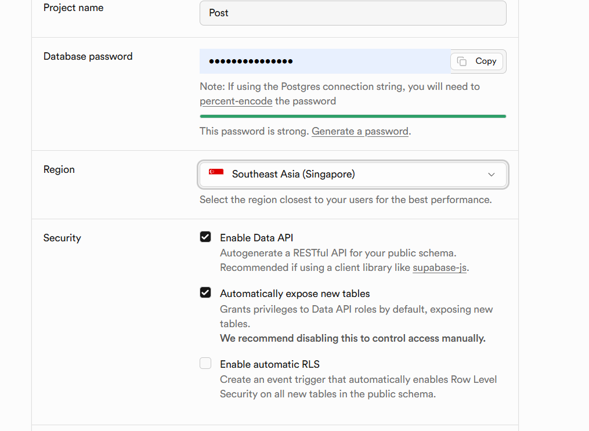

### 创建数据表

进入 **SQL Editor**，执行：

```sql
CREATE TABLE postcard (
  id text PRIMARY KEY,
  type text,
  country text,
  region text,
  note text,
  tags text,
  "imgFront" text,
  "sendDate" date,
  "receiveDate" date,
  person text,
  platform text
);
```

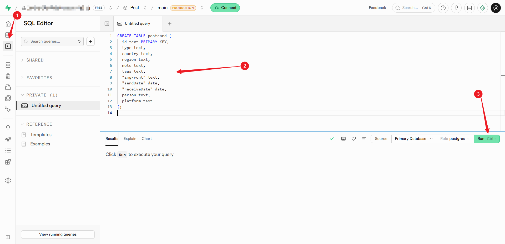

Run 之后有个弹窗，点击 **Run and enable RLS**：

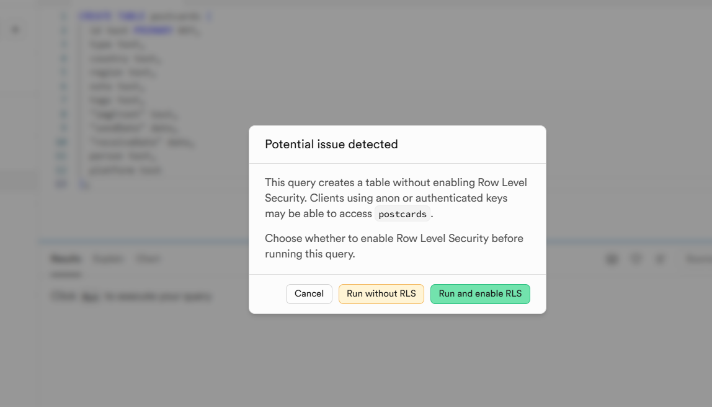


### 配置 RLS 策略

启用 RLS 并允许公开读取：

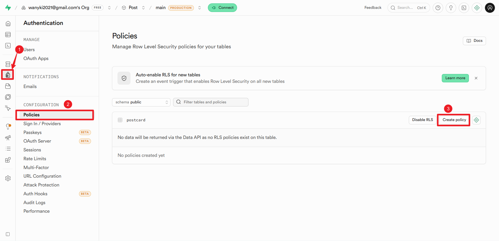

管理员写选项：

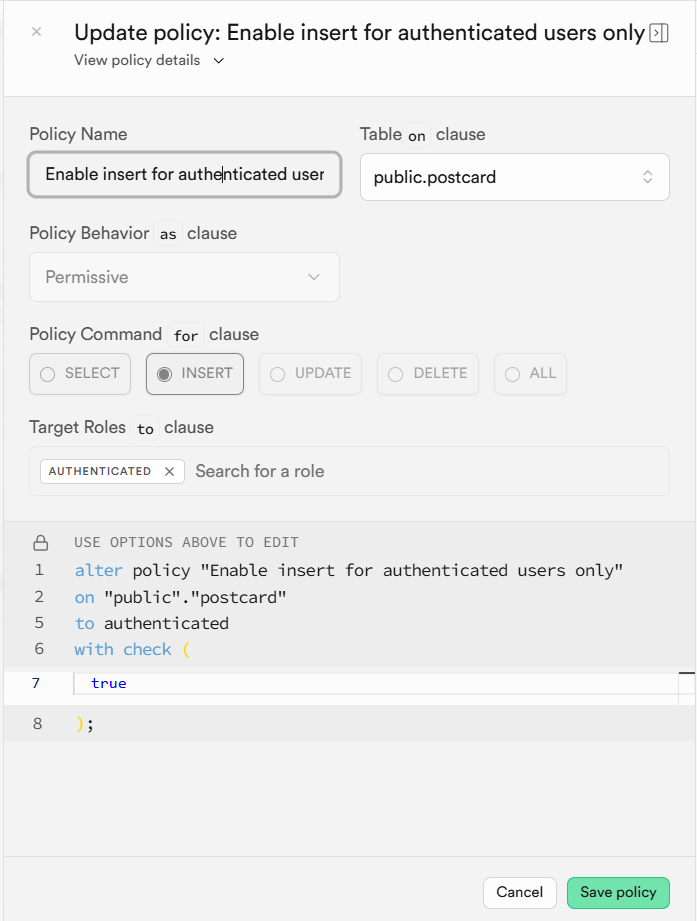

公共读选项：

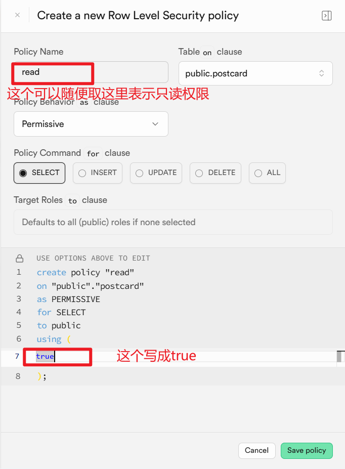

### 获取密钥

进入 **Project Settings → API**，复制：
- **Project URL**：`https://xxxx.supabase.co`
- **anon public key**：`sb_publishable***`

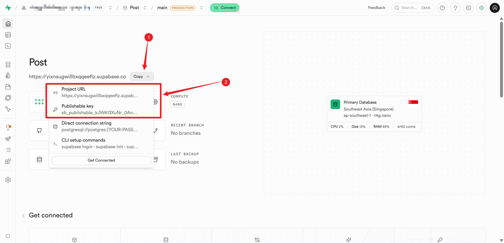

------

## 3️⃣ 修改代码配置

将以下 4 个文件中的 Supabase 配置替换为你自己的：

- `app.js`
- `dashboard.html`
- `detail.html`
- `timeline.html`

找到：
```javascript
const supabaseUrl = 'https://twrdvfeswnywkgqjbjdz.supabase.co';
const supabaseKey = 'sb_publishable_NQpsX76wlKtglbYskxwhiQ_T024LL_X';
```

替换为：
```javascript
const supabaseUrl = 'https://你的项目ID.supabase.co';
const supabaseKey = '你的anon key';
```

修改好后即可推送到GitHub

------

## 4️⃣ 配置图片托管（二选一）

### 方式一：GitHub 仓库

将图片上传到 `images` 文件夹，并将 Supabase 中 `imgFront` 改为 `images/[文件名]`。

### 方式二：阿里云 OSS

1. 创建 Bucket，设置**公共读**
2. 上传图片，URL 格式：
   ```
   https://你的Bucket.oss-cn-hangzhou.aliyuncs.com/图片名.jpg
   ```
   公共链不一定可用，最好绑定域名
------

## 5️⃣ 添加测试数据

新建第一条测试数据：

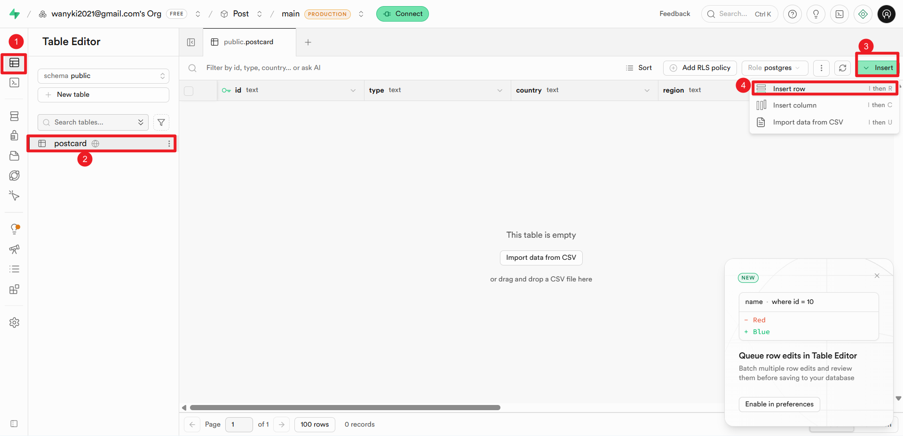

数据示例：

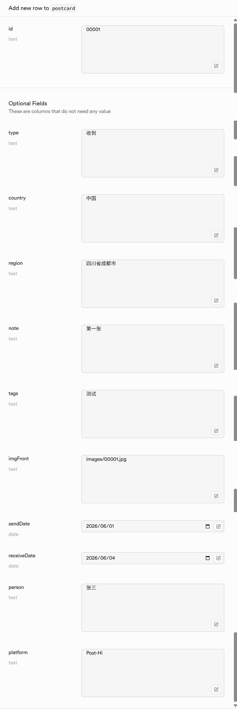

------

## 6️⃣ 部署

### 方式一：Vercel 部署（推荐）

1. 登录 [vercel.com](https://vercel.com/)推荐使用github登录
2. 点击 **New Project**，导入你的仓库
3. 点击 **Deploy**
4. 可以在domain按钮下绑定自己域名或使用默认提供域名，默认域名可能会被墙，推荐绑定域名
   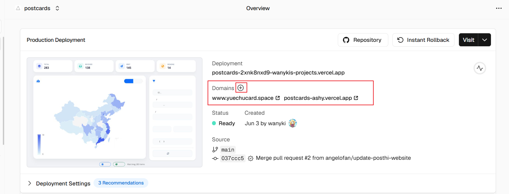
5. 也可以使用GitHub Page进行部署，具体需要自行搜索

### 方式二：本地运行测试

由于本项目纯前端，在 VSCode 中安装 Live Server 插件：

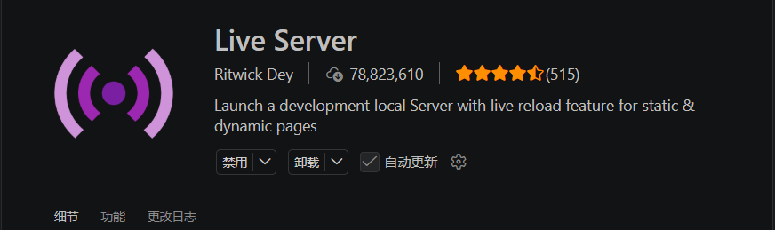

打开 HTML 文件，右键选择 **Open with Live Server** 即可：

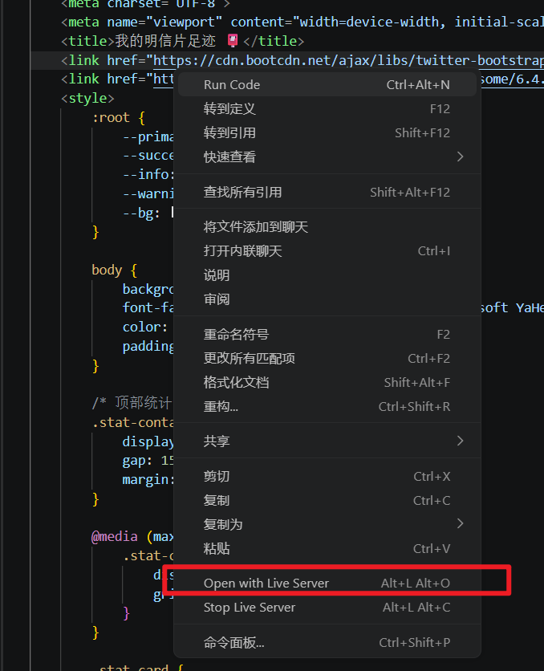

------

#### 字段说明

| 字段 | 说明 | 示例 |
|------|------|------|
| id | 明信片 ID | `PC001` |
| type | 收到或寄出 | `收到` |
| country | 国家 | `中国` |
| region | 省市 | `四川省成都市` |
| note | 留言 | `来自北京的问候` |
| tags | 标签 | `风景,城市` |
| imgFront | 图片 URL 或 GitHub 仓库相对地址 | `https://xxx.oss.cn/001.jpg或images/[文件名]` |
| sendDate | 寄出日期 | `2026-01-01` |
| receiveDate | 收到日期 | `2026-01-05` |
| person | 对方昵称 | `小明` |
| platform | 平台名称 | `Post-Hi` |

------
<p align="center"><small>如有问题，欢迎提 Issue 💬</small></p>
