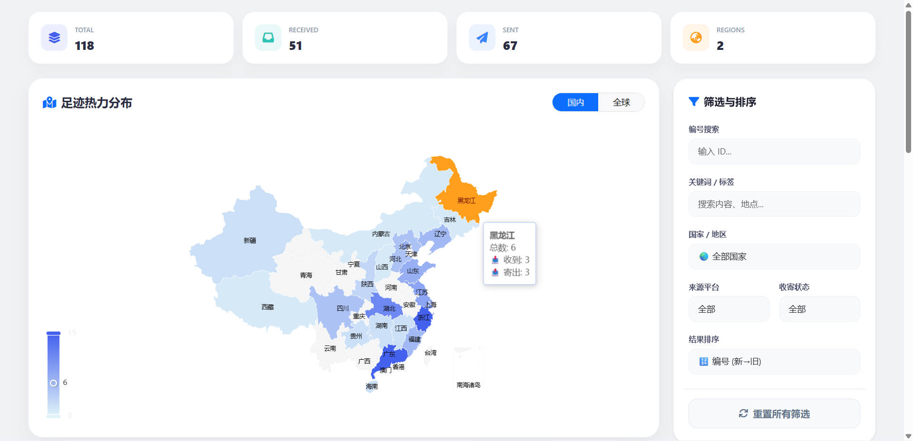

# 📮 我的明信片足迹 (Postcard Footprints)

> **“每一张明信片，都是一次跨越时空的握手。”**

### 🌟 初衷 (About)

2025年12月7日，我第一次接触明信片，从此便深深着迷于那张方寸纸片背后的温度。随着收发数量的日益增长，为了更好地珍藏这些来自世界各地的记忆，我决定搭建这个**个人明信片数字化收集册**。

本项目在 **Gemini** 的协助下完成，旨在记录每一份漂洋过海的祝福，并可视化展示我的足迹分布。

------

### ✨ 核心功能

- **📍 足迹热力图**：动态展示国内及全球范围内的明信片收发分布。
- **🖼️ 记忆画廊**：瀑布流式展示明信片正反面，支持多种自由排序（日期、编号、漂流时长）。
- **⏳ 漂流记录**：自动计算并显示明信片在旅途中的天数 ✈️。
- **🔍 智能筛选**：支持按国家、城市、平台、收寄状态等维度进行快速检索。

------

### 🗺️ 推荐交流平台

如果你也热爱纸质书写的浪漫，以下是我常用且推荐的明信片互寄网站：

| **平台名称**       | **链接**                                          | **特点**               |
| ------------------ | ------------------------------------------------- | ---------------------- |
| **Post-Hi**        | [post-hi.com](https://www.post-hi.com/home)       | 国内活跃的互寄社区     |
| **Manyour**        | [manyour.cn](https://manyour.cn/)                 | 界面清新，体验优良     |
| **ICardYou (ICY)** | [icardyou.icu](https://icardyou.icu/index)        | 资深玩家云集的交流地   |
| **Postcrossing**   | [postcrossing.com](https://www.postcrossing.com/) | 全球最大的随机互寄平台 |

------

### 🛠️ 技术实现

项目基于原生 Web 技术栈构建，追求轻量与高效：

- **前端框架**: [Vue.js 2.7](https://www.google.com/search?q=https://vuejs.org/)
- **可视化引擎**: [Apache ECharts](https://www.google.com/search?q=https://echarts.apache.org/)
- **UI 样式**: [Bootstrap 5](https://www.google.com/search?q=https://getbootstrap.com/) & [Font Awesome 6](https://www.google.com/search?q=https://fontawesome.com/)
- **地图数据**: 中国/世界地理 JSON 数据

------

### 📸 预览截图

------

### 📅 更新记录 (Changelog)

#### [2.1.2] - 2026-01-20

#### 🐞 修复与优化

- **修改完善筛选逻辑**：筛选逻辑出现部分问题，这次更新修改，网站更完善了

#### [2.1.1] - 2026-01-17

#### 🐞 修复与优化

- **完善项目**：新增README文件，CHANGELOG文件，显得更正式一点，嘿嘿

#### [2.1.0] - 2026-01-17

#### ✨ 新增功能
- **排序系统升级**：增加了“漂流时长”、“地理位置”、“日期双向”等多种自由排序方式。
- **漂流时长显示**：在明信片卡片上直观展示从寄出到收到的飞行天数（✈️）。

#### 🐞 修复与优化

- **地图切换修复**：解决了热力图在切换“国内/全球”时，国际明信片数据不显示或映射错误的问题。
- **编号逻辑优化**：优化了 ID 排序算法，支持 `ZJ-9` 与 `ZJ-10` 的自然数字排序。

#### [2.0.0] - 2026-01-16

- 实现地图足迹展示与基本画廊功能。

- 借助Gemini，UI美化完成，功能基本完善

#### [1.0.0] - 2026-01-15/2026-01-14

- 项目初始发布，其实具体干了什么不记得了，但是好像是14号开始发的

---

<small>本项目所有内容均由 Gemini 协助完成</small>
