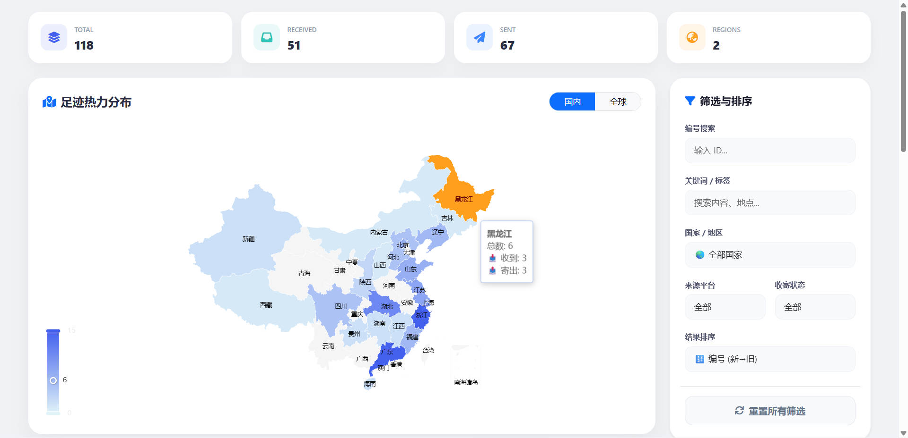
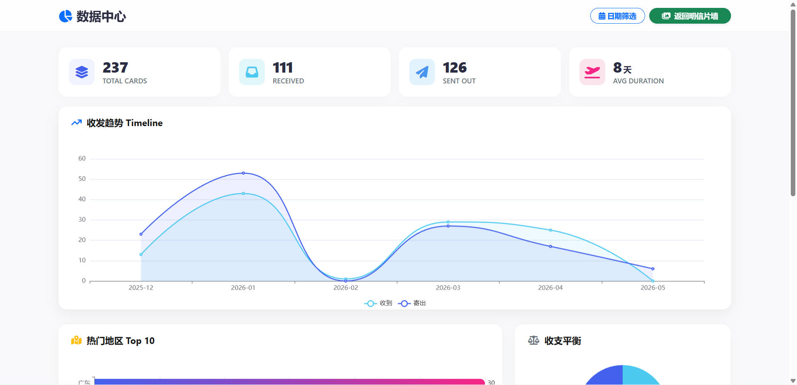

# 📮 我的明信片足迹 (Postcard Footprints)

> **“每一张明信片，都是一次跨越时空的握手。”**

### 🌟 初衷 (About)

2025年12月7日，我第一次接触明信片，从此便深深着迷于那张方寸纸片背后的温度。随着收发数量的日益增长，为了更好地珍藏这些来自世界各地的记忆，我决定搭建这个**个人明信片数字化收集册**。

本项目在 **Gemini与Mimo** 的协助下完成，旨在记录每一份漂洋过海的祝福，并可视化展示我的足迹分布。

------

### ✨ 核心功能

- **📍 足迹热力图**：动态展示国内及全球范围内的明信片收发分布。
- **🖼️ 记忆画廊**：瀑布流式展示明信片正反面，支持多种自由排序（日期、编号、漂流时长）。
- **📊 数据中心**：可视化数据面板，包含收发趋势、热门地区、漂流时长分布等多种图表。
- **🔍 智能筛选**：支持按国家、城市、平台、收寄状态等维度进行快速检索。
- **📅 日期筛选**：独立的日期范围筛选页面，支持快捷时间选择、按月趋势图与数据表格预览。

------

### 🗺️ 推荐交流平台

如果你也热爱纸质书写的浪漫，以下是我常用且推荐的明信片互寄网站：

| **平台名称**       | **链接**                                          | **特点**               |
| ------------------ | ------------------------------------------------- | ---------------------- |
| **Post-Hi**        | [post-hi.com](https://www.post-hi.com/)           | 国内活跃的互寄社区     |
| **Manyour**        | [manyour.cn](https://manyour.cn/)                 | 界面清新，体验优良     |
| **ICardYou (ICY)** | [icardyou.icu](https://icardyou.icu/index)        | 资深玩家云集的交流地   |
| **Postcrossing**   | [postcrossing.com](https://www.postcrossing.com/) | 全球最大的随机互寄平台 |

------

### 🛠️ 技术实现

项目基于原生 Web 技术栈构建，追求轻量与高效：

- **前端框架**: [Vue.js 2.7](https://www.google.com/search?q=https://vuejs.org/)
- **可视化引擎**: [Apache ECharts](https://www.google.com/search?q=https://echarts.apache.org/)
- **UI 样式**: [Bootstrap 5](https://www.google.com/search?q=https://getbootstrap.com/) & [Font Awesome 6](https://www.google.com/search?q=https://fontawesome.com/)
- **地图数据**: 中国/世界地理 JSON 数据

------

### 📦 部署文档

详细的部署指南请查看 [DEPLOYMENT.md](./DeploymentDoc/DEPLOYMENT.md)，包含：
- Supabase 数据库配置
- 图片托管方案
- Vercel 部署流程
- 本地测试方法

------

### 📸 预览截图

------

> 📋 完整更新日志请查看 [CHANGELOG.md](./CHANGELOG.md)

---

<small>本项目所有内容均由 Gemini与Mimo 协助完成</small>

